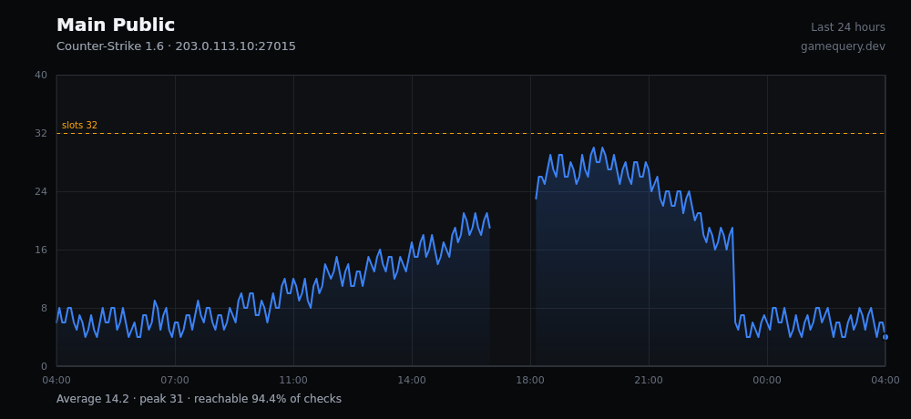
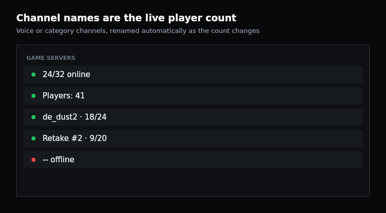
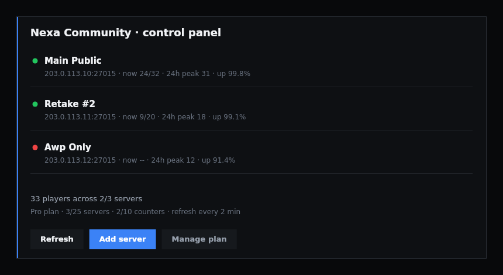
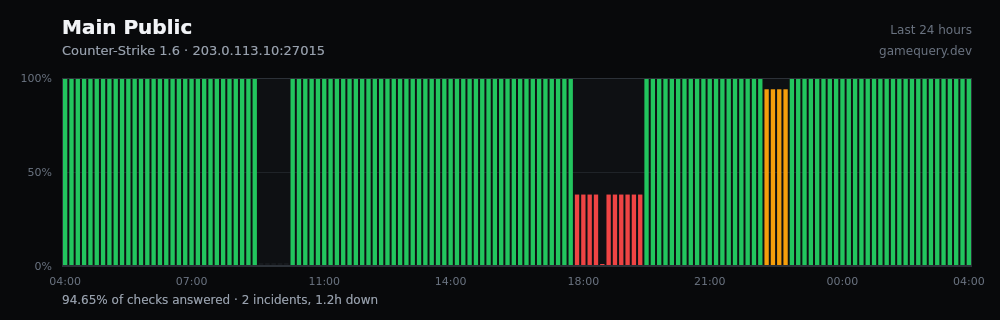
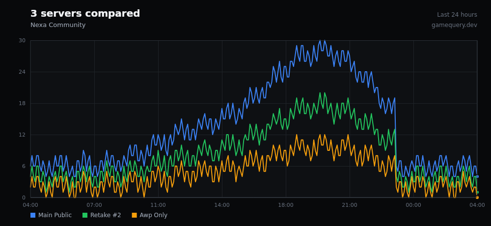
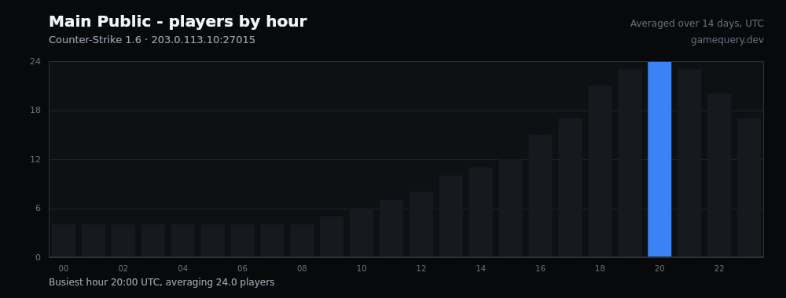

# GameQuery Discord Bot

Live game server status in Discord: channels whose name is the player count,
messages that rewrite themselves, player and uptime graphs, and alerts.
334 games, from Counter-Strike 1.6 to Rust, ARK, Minecraft and Palworld.

Run it yourself with the instructions below, or
[invite the hosted one](https://gamequery.dev/discord/invite) and skip the
hosting entirely.



---

## Contents

- [What it does](#what-it-does)
- [Gallery](#gallery)
- [Commands](#commands)
- [Self-hosting](#self-hosting)
- [Configuration](#configuration)
- [How it works](#how-it-works)
- [Hosted vs self-hosted](#hosted-vs-self-hosted)
- [Development](#development)
- [Licence](#licence)

---

## What it does

**Counter channels.** A voice or category channel whose name *is* the live
player count, like `24/32 online`. It renames itself as the number changes.

**Self-updating messages.** A status card for one server, a board of all of
them, or a graph that redraws in place. One message that stays current, not a
new message every minute.

**Player graphs.** Player count over time as a rendered image, with the
average, the peak, and how often the server actually answered.

**Uptime.** Availability over time, with incidents grouped and timed. A bucket
with no samples is drawn as "no data", never as an outage.

**Alerts.** A ping when a server goes offline, comes back, fills up, empties,
changes map, or crosses a player count you choose. Role mentions and per-alert
cooldowns included.

**Scheduled reports.** A daily or weekly digest: servers ranked by peak,
average players against the previous window, availability, and a chart.

**A control panel.** `/dashboard` gives you buttons and a menu instead of
twelve commands to memorise.

## Gallery

| | |
|---|---|
| **Counter channels**<br>Channel names that are the live count |  |
| **Control panel**<br>`/dashboard` — manage everything by button |  |
| **Uptime**<br>Incidents, grouped and timed |  |
| **Comparison**<br>Several servers on one chart |  |
| **Peak hours**<br>When your community is actually online |  |

## Commands

| Command | What it does |
| --- | --- |
| `/dashboard` | Control panel: view, add, chart and remove servers by button |
| `/server` | Query any address on demand, tracked or not |
| `/track add \| remove \| list \| label` | Choose which servers this Discord follows |
| `/counter create \| attach \| remove \| list \| tokens` | Channels whose name is the live count |
| `/live status \| list \| graph \| remove \| show` | Messages that rewrite themselves |
| `/graph players \| compare \| peak` | Player count over time, several servers, hour-of-day |
| `/uptime` | Availability and the incident list |
| `/alert add \| remove \| list` | Offline, online, full, empty, map change, thresholds |
| `/report add \| remove \| list \| preview` | Scheduled daily or weekly digests |
| `/players` | Live player list with scores |
| `/export` | Raw history as CSV |
| `/games` | Search the supported games |
| `/link`, `/pro` | Account linking and plan (hosted instance only) |
| `/help` | Setup guide |

## Self-hosting

### You will need

- **Node.js 20+** (or Docker)
- **PostgreSQL 13+** — an empty database is fine, the bot creates its own schema
- **A Discord bot token** — [Developer Portal](https://discord.com/developers/applications)
  → your app → Bot → Reset Token
- **A gamequery.dev API key** — free, from
  [gamequery.dev/dashboard/keys](https://gamequery.dev/dashboard/keys)

The API key is required. This bot does not speak game protocols itself: every
server reading comes from the gamequery.dev API, which is what lets it query
334 games without you opening a port, running a query node, or getting your IP
rate-limited by a game server. Without a key it will refuse to start rather
than run and report every server as unknown.

A free key allows 1440 requests a day. The bot batches up to 1000 servers into
one request, so a five-minute poll costs 288 requests a day no matter how many
servers you track.

### With Docker

```sh
git clone https://github.com/DemOnJR/gamequery-discord-bot.git
cd gamequery-discord-bot
cp .env.example .env
$EDITOR .env          # fill in the four required values
docker compose up -d
```

`docker compose` starts Postgres alongside the bot. If you already have one,
set `DATABASE_URL` and run `docker compose up -d bot`.

### Without Docker

```sh
git clone https://github.com/DemOnJR/gamequery-discord-bot.git
cd gamequery-discord-bot
npm install --omit=dev
cp .env.example .env
$EDITOR .env
node --env-file=.env src/index.js
```

Charts need a font. On Debian or Ubuntu, `apt install fonts-dejavu-core`, then
point `FONT_DIR` at `/usr/share/fonts/truetype/dejavu`. Without it charts still
render, but with no text on them.

### Invite it

The bot prints its own invite URL at startup. It needs these permissions:

`Manage Channels` (renaming counter channels), `View Channels`,
`Send Messages`, `Manage Messages`, `Embed Links`, `Attach Files`,
`Read Message History` — permission integer `125968`.

Leave **all three privileged gateway intents off**. The bot requests only the
`Guilds` intent, so it cannot read your messages or your member list, and the
application never needs Discord's intent review.

## Configuration

Everything is environment variables. Only the first four are required.

| Variable | Default | What it is |
| --- | --- | --- |
| `DISCORD_BOT_TOKEN` | — | **Required.** Bot token from the Developer Portal |
| `GAMEQUERY_API_TOKEN` | — | **Required.** API key from gamequery.dev |
| `GAMEQUERY_API_EMAIL` | — | **Required.** The account the key belongs to |
| `GAMEQUERY_API_TYPE` | `FREE` | **Required.** `FREE` or `PRO`, matching the key |
| `DATABASE_URL` | — | Postgres connection string |
| `DATABASE_SSL` | `false` | Set `true` for a managed Postgres |
| `GAMEQUERY_API_URL` | `https://api.gamequery.dev` | API host |
| `PLAN_MODE` | `unlimited` | `unlimited` unlocks everything. Leave it alone |
| `FONT_DIR` | `/usr/share/fonts/dejavu` | Where DejaVu lives |
| `SAMPLER_INTERVAL_MINUTES` | `5` | How often history is sampled |
| `PRO_REFRESH_MINUTES` | `2` | How often counters and live messages refresh |
| `SAMPLE_RETENTION_DAYS` | `35` | How long 5-minute samples are kept |
| `HOURLY_RETENTION_DAYS` | `400` | How long hourly rollups are kept |
| `HEALTH_PORT` | `8081` | `GET /healthz` |
| `BOT_DEBUG` | `false` | Verbose logging |

The full list, including every plan limit, is in [`.env.example`](.env.example)
and [`src/config.js`](src/config.js).

## How it works

```
Discord  <-->  bot  <-->  gamequery.dev API  -->  worker fleet  -->  game servers
                 |
                 +-->  PostgreSQL (its own schema)
```

The bot never contacts a game server. It asks gamequery.dev, whose distributed
worker fleet does the probing, so a firewalled server sees those probes and not
traffic from your host, and you do not maintain fifty game protocols.

Postgres holds the bot's own state and its player history. History is keyed on
the **server**, not on a Discord guild, so two guilds watching the same address
share one history and it survives an untrack and retrack.

Four background loops:

| Loop | Default | Job |
| --- | --- | --- |
| sampler | 5 min | One player-count sample per tracked server |
| refresher | 60 s | Renames counters, rewrites live messages |
| alerts | 2 min | Evaluates alert transitions |
| reports | 5 min | Sends scheduled digests that are due |

Things worth knowing if you plan to modify it:

- **Discord rate-limits channel renames to twice per ten minutes per channel**,
  and enforces it by queueing rather than erroring. A rename is only spent when
  the rendered name actually differs from the last one written.
- **Alerts fire on transitions, never on states.** A server down for a week
  pings once, not every two minutes.
- **An unreachable server renders as `--`, never `0`.** Telling members a
  server is empty is a different and more damaging claim than telling them it
  cannot be reached.
- **Run one instance.** Two on the same token would both rename channels and
  could double-post alerts.

## Hosted vs self-hosted

|  | Self-hosted | [Hosted](https://gamequery.dev/discord/invite) |
| --- | --- | --- |
| Cost | Your server, your API key | Free tier, Pro from 4.69 EUR/mo |
| Features | All of them | Free tier is capped; Pro unlocks the rest |
| Postgres | Yours to run and back up | Ours |
| Updates | `git pull` | Automatic |
| API quota | Your key's | Ours |

Self-hosting gives you everything with no feature gate, because you already
paid with a key and a server. The hosted instance exists for people who would
rather not run either.

## Development

```sh
npm install
mkdir -p data && curl -s https://api.gamequery.dev/v1/get/games > data/games.json
npm run check
```

`npm run check` needs no token and no database. It verifies the slash-command
payloads Discord would accept, the channel-name renderer, the alert transition
rules, address validation, guild isolation across every database call, and that
the charts render with real text. The Docker build runs it, so a broken command
signature fails the build rather than the boot.

`node src/registerCommands.js <guildId>` installs the commands to one guild for
testing. Guild-scoped commands appear instantly; global ones can take up to an
hour on first publish.

Pull requests are welcome. Keep `npm run check` green.

## Licence

MIT. See [LICENSE](LICENSE).

Not affiliated with Discord. Game names and trademarks belong to their owners.
